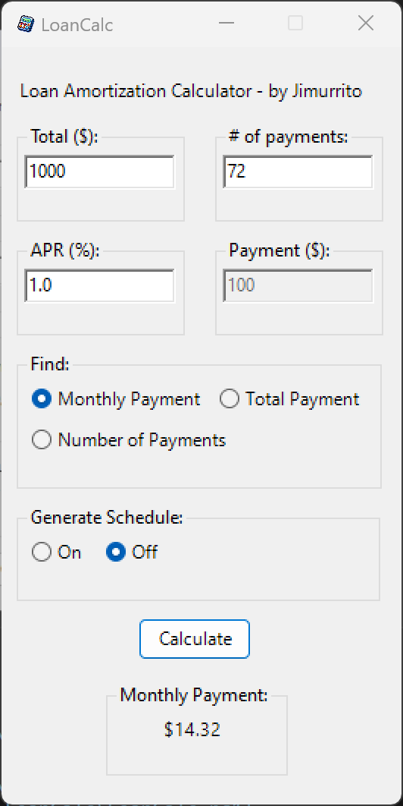

<h1> LoanCalc</h1>

Loan Amortization tool built in Powershell. Uses the `System.Windows.Forms` classes built into C#.

> **Note:** This script only supports Windows OS, even though it supports Powershell Core.

# Getting Started

- Download from Github.
- Open a powershell session from the repo's directory.
- Right-click and select 'Run with Powershell' or run the below in a powershell session:

  
**Powershell Core (7.0)**
``` Powershell
pwsh .\LoanCalc.ps1 
```

**Legacy Powershell (5.1)**
``` Powershell
powershell .\LoanCalc.ps1 
```
This is a graphical diffrence when you run the app from Powershell core vs legacy powershell. See below for more.


# GUI

### Legacy Powershell

  

### Powershell Core

  

## Payment Schedule Generation

Data tables in Windows Forms have not been updated, thus there is no noticable diffrence between


> **Note:** The schedule is only generated when `Generate Schedule` is toggled `On`. The schedule can also be generated on its own, without the need to run `LoanCalc.ps1`. [See section on `LoanCalc_sched.ps1` for more info.](#loancalc_schedps1)


# Functionality

The app can perform the following calculations:
  - [Find Monthly Payment Amount](#find-monthly-payment-amount)
  - [Find Total Loan Amount](#find-total-loan-amount)
  - [Find Term of the Loan](#find-term-of-the-loan)


## Find Monthly Payment Amount
Monthly payment (A) can be found with the APR, Loan term (n), and Total Loan amount (P). APR is divided by `12` to provide the Monthly Interest rate (i).

```
        i * P  
A = ────────────── 
    1 - (1 + i)^-n 
```

```Math.. uwu
In this example, the total loan amount is `$1000`, the APR is `1.0%`, and the loan term is 72 months.

Monthly Interest rate:
0.833 = 0.01 / 12


P = 1000                   0.000833 * 1000
i = 0.000833   ~14.32 = ──────────────────────
n = 72                  1 - (1 + 0.000833)^-72


The Monthly payment is `$14.32`.
```


## Find Total Loan Amount
Total payment (P) can be found with the APR, Loan term (n), and Monthly Loan payment (A). APR is divided by `12` to provide the Monthly Interest rate (i).

```
        1 - (1 + i)^-n
P = A x ────────────── 
              i
```

```Math.. uwu
In this example, the monthly loan payment is `$100`, the APR is `1.0%`, and the loan term is 72 months.

Monthly Interest rate:
0.833 = 0.01 / 12


A = 100                          1 - (1 + 0.000833)^-72
i = 0.000833   ~$6985.43 = 100 x ──────────────────────  
n = 72                                  0.000833


The total loan amount is `$6985.43`.
```


## Find Term of the Loan
The term of the loan (n) can be found with the APR, Total Loan Amount (P), and Monthly Loan payment (A). APR is divided by `12` to provide the Monthly Interest rate (i).

```    
            1 - (i * P) 
      log ( ─────────── )
                 A       
n = - ───────────────────
         log ( 1 + i )
```

```Math.. uwu
In this example, the monthly loan payment is `$100`, the APR is `1.0%`, and the total loan amount is `$1000`.

Monthly Interest rate:
0.833 = 0.01 / 12

                             1 - (0.000833 * 1000)
                       log ( ───────────────────── )
A = 100                              100
i = 0.000833   ~11 = - ─────────────────────────────
P = 1000                   log ( 1 + 0.000833 )


The term of the loan is `11` Months.
```

# Amortization Scheduling

This functionality can be achieved via two methods.
- via LoanCalc.ps1 (Toggle `Generate Schedule = On` in the GUI)
- via LoanCalc_sched.ps1

The schedule is generated based on inputs and desired calculation. This allows the schedule to forcast alternative payment plans. To achieve this, select the `# of Payments` option under `Find:`. Then ensure your desired payment is entered. 

> **Note:** By default, the schedule assumes one payment per month. This, and the intervals unit of Months can not be changed <u>as of now.</u>


## LoanCalc_Sched.ps1

This is the core script to generate the schedule in a `System.Windows.Form` form. This script is triggered when Toggle `Generate Schedule = On` in the GUI. This section provides as example on how to run this script via command line.

```Powershell
.\LoanCalc_sched.ps1

# or

.\LoanCalc_sched.ps1 -TotalAmount 1000 -NumoPayments 72 -APR 0.01 -MonthlyPayment 100
```

Due to how the evaluation works, the schedule will ignore the Number of payments parameter `-NumoPayments` if the loan has been paid off early.
In the example above, the schedule will end after the 11th payment; not continuing until the 72 month requirement was met.
